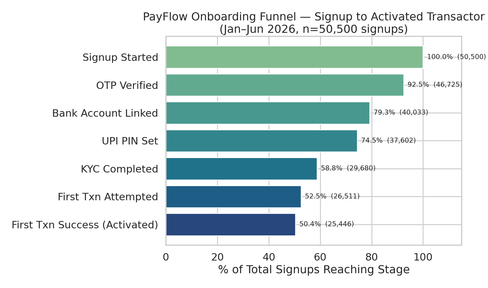
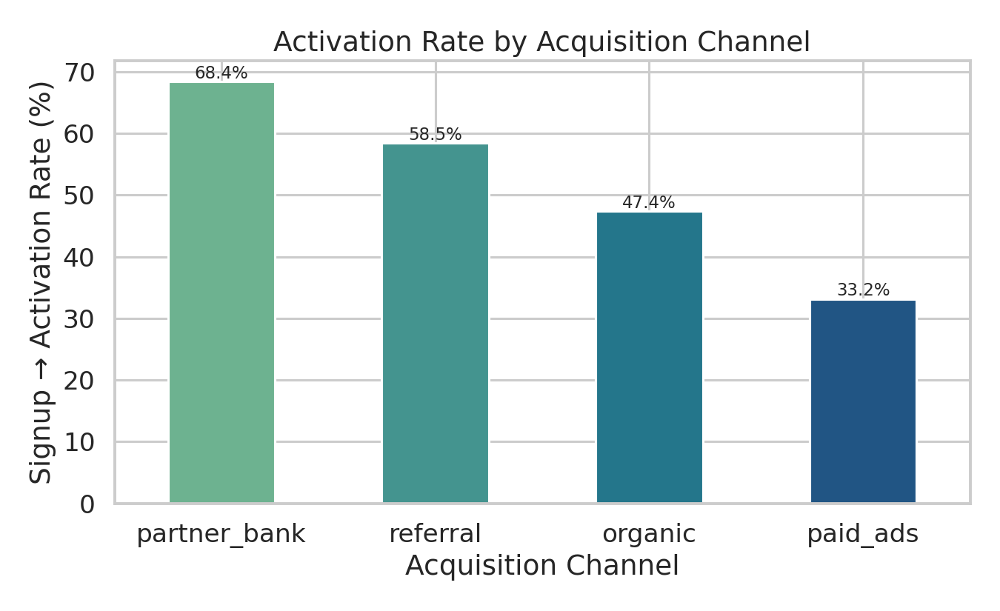
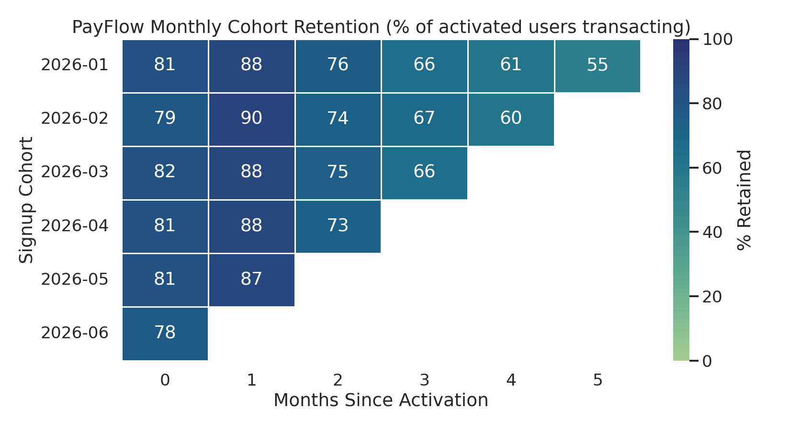
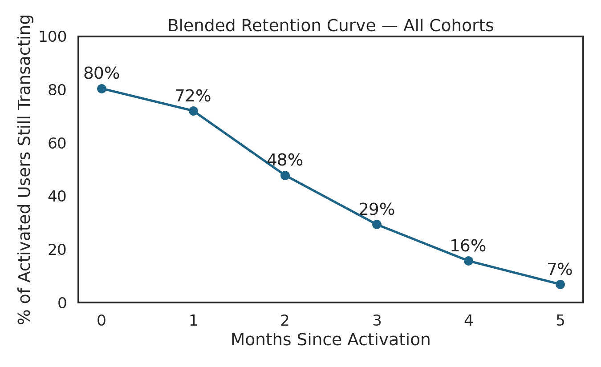
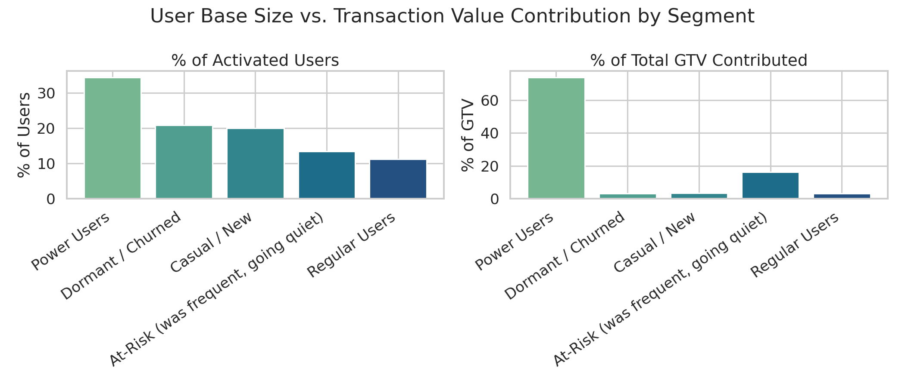
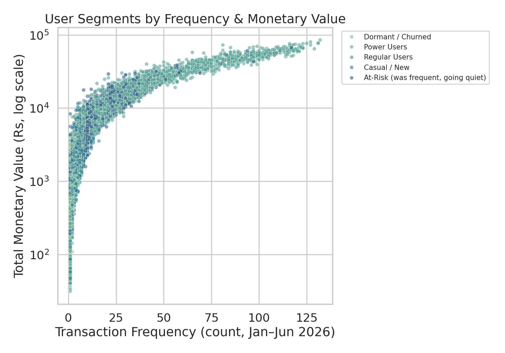
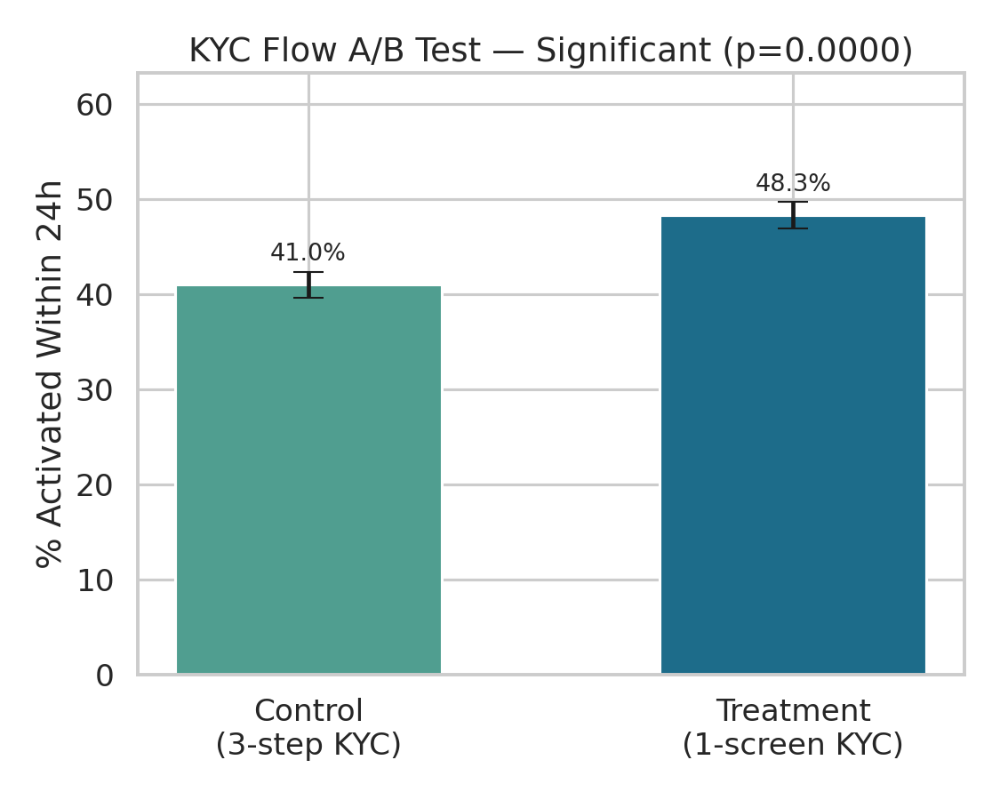

# PayFlow — UPI Payments Product Analytics

**Project 2 of 5 in a Product Analyst portfolio.** End-to-end product
analytics on a simulated Indian UPI payments app: onboarding funnel,
monthly cohort retention, RFM-based user segmentation, and an A/B test —
built the way a Product Analyst at a company like PhonePe, Razorpay, or
Paytm would actually structure the work, not as a generic dashboard.

Stack: **Python (pandas, numpy, seaborn, scipy) → SQL (BigQuery Standard
SQL) → Power BI**

> **On the data:** No public dataset captures UPI-level funnel and
> transaction behavior, so this project uses a parameterized simulation
> instead of a proxy dataset dressed up as fintech data. Every assumption is
> documented in [`docs/assumptions.md`](docs/assumptions.md), and every
> number below is computed from the generated data, not invented — see
> [`docs/assumptions.md`](docs/assumptions.md) for exactly what's simulated
> and why, and [`docs/product_thinking.md`](docs/product_thinking.md) for
> the business framing behind the analysis.

---

## The Business Question

PayFlow has strong signup volume, but leadership suspects a large share of
new users never become habitual transactors — meaning acquisition spend
isn't converting into the recurring transaction volume that actually drives
revenue (merchant discount rate on P2M, float, cross-sell). This project
answers: **where exactly do users drop off, who sticks around, and does a
proposed onboarding fix actually move the number?**

Full product framing — hypotheses, North Star Metric, input/output metrics —
in [`docs/product_thinking.md`](docs/product_thinking.md).

---

## Dataset (generated by `scripts/01_generate_synthetic_data.py`)

| Table | Rows | Description |
|---|---|---|
| `users.csv` | 50,500 | Signups, Jan–Jun 2026, with channel/city-tier/device |
| `funnel_events.csv` | ~256K | Every onboarding step per user, timestamped |
| `transactions.csv` | ~442K | All P2P/P2M transactions, success and failure |
| `ab_test_kyc_flow.csv` | 10,100 | April-cohort KYC flow experiment assignment + outcome |

---

## 1. Onboarding Funnel

`scripts/02_funnel_analysis.py` · `sql/funnel_queries.sql`



| Stage | Users Reached | % of Signups | Step Conversion |
|---|---:|---:|---:|
| Signup Started | 50,500 | 100.0% | — |
| OTP Verified | 46,725 | 92.5% | 92.5% |
| Bank Account Linked | 40,033 | 79.3% | 85.7% |
| UPI PIN Set | 37,602 | 74.5% | 93.9% |
| **KYC Completed** | **29,680** | **58.8%** | **78.9%** |
| First Txn Attempted | 26,511 | 52.5% | 89.3% |
| First Txn Success (Activated) | 25,446 | **50.4%** | 96.0% |

**Overall signup → activation conversion: 50.4%.** Half of everyone who
starts signing up never completes a successful transaction.

**Biggest single drop-off: KYC Completion, at 78.9% step conversion** — this
is where the funnel bleeds the most users, more than any other step,
confirming H1 in the product thinking doc.

### Activation Rate by Acquisition Channel


| Channel | Activation Rate |
|---|---:|
| Partner Bank | 68.4% |
| Referral | 58.5% |
| Organic | 47.4% |
| Paid Ads | 33.2% |

Paid-ads-acquired users activate at **less than half** the rate of
partner-bank users — a >2x gap on the same top-of-funnel spend, confirming
H2. This is the single clearest budget-reallocation signal in the dataset.

---

## 2. Cohort Retention

`scripts/03_cohort_retention.py` · `sql/cohort_retention.sql`




Blended retention across all six monthly cohorts (% of activated users
still transacting N months after activation):

| Months Since Activation | 0 | 1 | 2 | 3 | 4 | 5 |
|---|---:|---:|---:|---:|---:|---:|
| % Retained | 80.4% | 72.0% | 47.8% | 29.3% | 15.6% | 6.8% |

Retention is stable in month 1 (72.0%, close to month 0's 80.4%) but drops
sharply from month 1 to month 2 (72.0% → 47.8%, a 24-point fall) — the
steepest single-month decline in the curve. That's the window where a
re-engagement nudge (payment reminders, cashback on next transaction) would
have the most leverage, before the habit fails to form entirely.

---

## 3. User Segmentation (RFM)

`scripts/04_user_segmentation.py` · `sql/segmentation.sql`




Segments derived independently from raw transaction recency/frequency/value
— not from any label baked into the generator (see methodology note in
`docs/assumptions.md`):

| Segment | Users | % of Users | Total GTV (₹) | % of GTV |
|---|---:|---:|---:|---:|
| Power Users | 8,345 | 34.5% | 17.28 crore | **74.0%** |
| At-Risk (was frequent, going quiet) | 3,278 | 13.5% | 3.81 crore | 16.3% |
| Casual / New | 4,833 | 20.0% | 78.4 lakh | 3.4% |
| Dormant / Churned | 5,054 | 20.9% | 71.6 lakh | 3.1% |
| Regular Users | 2,712 | 11.2% | 77.3 lakh | 3.3% |

**A textbook Pareto pattern: 34.5% of activated users (Power Users) drive
74.0% of total transaction value.** Combined with At-Risk users (16.3% of
GTV from users who were frequent and are now going quiet), these two
segments alone account for **90.3% of GTV** from just 48% of the user base —
which is exactly where retention and win-back investment should concentrate,
not spread evenly across the whole base.

---

## 4. A/B Test — Simplified KYC Flow

`scripts/05_ab_test_analysis.py` · `sql/ab_test.sql`



Ran on the April 2026 signup cohort (10,100 users, 50/50 split): does
collapsing the 3-step KYC flow into a single screen improve 24-hour
activation?

| | Control (3-step) | Treatment (1-screen) |
|---|---:|---:|
| Users | 5,095 | 5,005 |
| Activated within 24h | 41.0% | 48.3% |

- **Absolute lift: +7.29 percentage points**
- **Relative lift: +17.8%**
- **Z-statistic: 7.37, p < 0.00001**
- **95% CI on lift: [+5.36pp, +9.22pp]**
- **Result: statistically significant at α = 0.05** — ship it.

This directly tests H4 and gives a concrete, defensible recommendation: the
simplified KYC screen should go to 100% of traffic, with an expected
activation lift in the mid-single-digit-to-high-single-digit percentage
point range based on the confidence interval.

---

## Repo Structure

```
PayFlow-UPI-Product-Analytics/
├── README.md                          <- you are here
├── requirements.txt
├── data/
│   ├── raw/                           <- generated CSVs (source of truth)
│   └── processed/                     <- script outputs (summaries, matrices)
├── scripts/
│   ├── 01_generate_synthetic_data.py
│   ├── 02_funnel_analysis.py
│   ├── 03_cohort_retention.py
│   ├── 04_user_segmentation.py
│   └── 05_ab_test_analysis.py
├── sql/
│   ├── schema.sql
│   ├── funnel_queries.sql
│   ├── cohort_retention.sql
│   ├── segmentation.sql
│   └── ab_test.sql
├── visuals/                            <- all seaborn/matplotlib charts (.png)
├── powerbi/
│   └── POWERBI_GUIDE.md               <- data model + DAX measures
└── docs/
    ├── assumptions.md                  <- every simulation parameter, justified
    └── product_thinking.md             <- business problem, hypotheses, North Star
```

## Running It

```bash
pip install -r requirements.txt
python scripts/01_generate_synthetic_data.py   # ~30s, writes data/raw/*.csv
python scripts/02_funnel_analysis.py
python scripts/03_cohort_retention.py
python scripts/04_user_segmentation.py
python scripts/05_ab_test_analysis.py
```

Each script prints its results to the console and writes summary CSVs to
`data/processed/` and charts to `visuals/`.

### Running the SQL
Written for **BigQuery Standard SQL**. To use:
1. Create a BigQuery project, run `sql/schema.sql` to create the dataset/tables
2. Load the four CSVs from `data/raw/` using `bq load` (commands included at
   the bottom of `schema.sql`)
3. Run `funnel_queries.sql`, `cohort_retention.sql`, `segmentation.sql`,
   `ab_test.sql` directly in the BigQuery console

For a local MySQL/PostgreSQL setup instead, swap `DATETIME` types as needed
and remove the `` `payflow_analytics.` `` project-qualified table prefixes.

### Building the Power BI Dashboard
See [`powerbi/POWERBI_GUIDE.md`](powerbi/POWERBI_GUIDE.md) — full data model,
relationships, and every DAX measure needed, ready to paste into Power BI
Desktop against the CSVs in `data/raw/`.

---

## Notes for Recruiters / Interviewers

This project is deliberately structured to demonstrate the full Product
Analyst workflow, not just SQL/Python proficiency:
- **Product framing before analysis** (`docs/product_thinking.md`) — problem,
  hypotheses, North Star Metric, input/output metrics, defined *before*
  looking at results
- **Explicit, falsifiable hypotheses**, each tagged confirmed/tested against
  what the data actually showed
- **Cross-validated in two languages** — every metric is computed once in
  pandas and once in SQL, the way you'd sanity-check a number before
  presenting it
- **Honest handling of a real analytical nuance** (right-censoring at the
  observation window edge — see `docs/assumptions.md`) rather than a report
  that pretends the data is perfectly clean
- **A shippable recommendation**, not just a chart — the A/B test section
  ends in a ship/no-ship call backed by a confidence interval, not just a
  p-value
